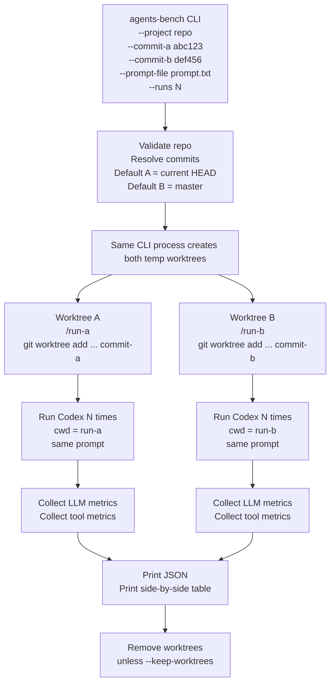

# Agents Bench CLI Plan

## Goal

Build a simple CLI that compares how two committed versions of `AGENTS.md` affect Codex API runs.

Implementation lives under `agentcd`.

## Flow



## CLI

```bash
python -m agentcd_bench \
  --project /path/to/repo \
  --commit-a abc123 \
  --commit-b def456 \
  --prompt-file examples/grafana-like-codebase/prompt.txt \
  --runs 5
```

Defaults:

- `--commit-a`: current `HEAD`
- `--commit-b`: `master`
- `--runs`: `1`

## Modules

- `agentcd_bench.cli`: argument parsing, printing, exit codes
- `agentcd_bench.service`: benchmark orchestration
- `agentcd_bench.git_worktrees`: commit resolution and worktree lifecycle
- `agentcd_bench.codex_client`: Codex CLI runner and mock runner
- `agentcd_bench.metrics`: avg, p50, p90 summaries
- `agentcd_bench.output`: comparison table rendering

This keeps the CLI thin so the orchestration layer can later be exposed through FastAPI.

## Metrics

LLM metrics:

- model
- input tokens
- output tokens
- total tokens
- reasoning tokens
- cached input tokens
- duration

Tool metrics:

- total tool call count
- per-tool count
- per-tool duration when available

For multiple runs, summaries include `avg`, `p50`, and `p90`.

## Example Fixture

The repo includes:

```text
agentcd/
  examples/
    grafana-like-codebase/
      AGENTS.md
      prompt.txt
```

The mock `AGENTS.md` models instructions for a large Grafana-like codebase that can handle feature work and bugfixes across frontend, backend, APIs, tests, and docs.

## Test And Validate

Run unit tests:

```bash
python -m unittest discover -s tests
```

Run a CLI smoke test without Codex credentials against any git repo with commits:

```bash
python -m agentcd_bench \
  --project /path/to/git/repo \
  --commit-a HEAD \
  --commit-b master \
  --prompt "Find and explain the main entrypoint." \
  --runs 1 \
  --runner mock
```

Run against the local Codex CLI:

```bash
python -m agentcd_bench \
  --project /path/to/git/repo \
  --commit-a abc123 \
  --commit-b def456 \
  --prompt-file examples/grafana-like-codebase/prompt.txt \
  --runs 1 \
  --runner codex
```
