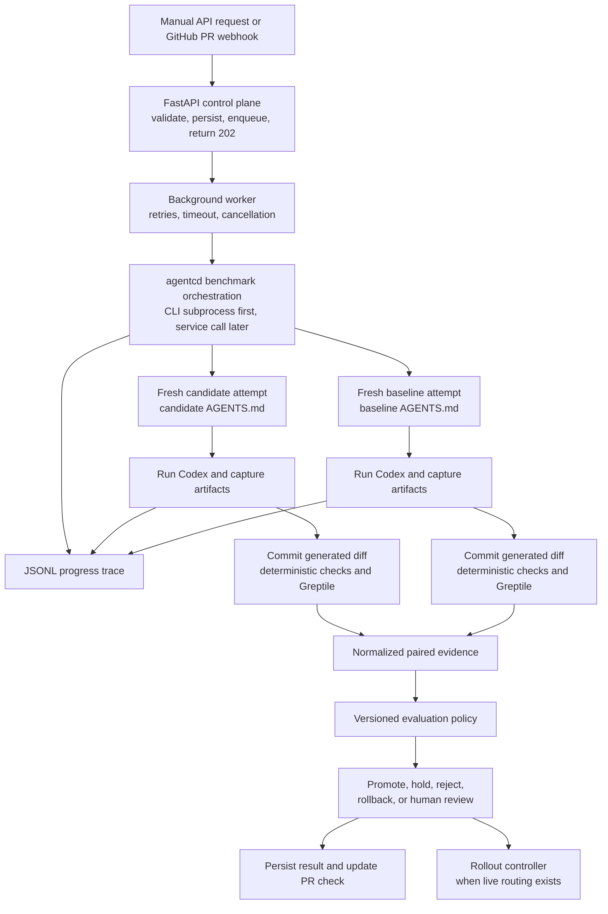

# Agent Evaluation And Progressive Rollout Plan

## Goal

Build a service that compares a baseline `AGENTS.md` configuration with a candidate configuration, evaluates the work produced by both agents, and makes an explainable rollout decision.

The first useful outcome is an offline decision about whether a candidate is eligible for shadow traffic. Later, the same policy consumes shadow and canary evidence to decide whether to hold, promote, reject, require human review, or roll back the candidate.

The existing implementation lives under `agentcd`. The synthetic prompt assets currently live at the repository root.

## Repository Baseline

This plan extends the code that is present today; it does not assume the FastAPI or evaluation layers already exist.

| Capability | Current repository state | Required next step |
| --- | --- | --- |
| CLI | `agentcd_bench.cli` accepts a repository, two commits, one prompt, a run count, a runner, and an optional trace-log path | Keep it as the local entrypoint and add a stable machine-readable evidence contract |
| Benchmark service | `run_benchmark` creates both worktrees and launches A and B concurrently; attempts within each version remain sequential | Make attempts independent, explicitly paired, cancellable, and artifact-producing |
| Worktrees | `WorktreeManager` creates two detached worktrees, one shared by all A attempts and one shared by all B attempts | Use a clean worktree or reset for every attempt and support temporary evaluation branches |
| Codex execution | `CodexExecRunner` invokes `codex exec --json --ephemeral` with closed stdin; `MockCodexRunner` supports credential-free tests | Preserve fresh sessions while also capturing the final response, generated diff, failures, and bounded raw events |
| Metrics | Token, duration, and tool counts are summarized with average, p50, and p90 | Add paired quality, reliability, evaluator, and policy evidence |
| Tracing | A thread-safe JSONL logger records benchmark, worktree, version, and attempt progress | Attach trace artifacts to durable jobs and keep them distinct from policy evidence |
| Output | JSON plus a Markdown comparison table, execution metadata, and log path | Add a schema version and named baseline/candidate records |
| Tests | Five `unittest` tests cover metrics, the mock CLI flow, A/B concurrency, and fresh Codex invocation | Add attempt-isolation, artifact, evaluator, policy, and worker tests |
| Prompt data | Seed instructions and 1,000 synthetic prompt records exist | Curate runnable tasks and bind them to repositories, setup, and expected checks |
| FastAPI, persistence, and workers | Not present | Add after the benchmark evidence boundary is stable |
| Greptile, policy, and routing | Not present | Add in separate, testable stages described below |

The current tests pass with `python3 -m unittest discover -s tests`.

## Existing Evaluation Assets

The repository contains:

- `seed_prompts.md`: instructions and seed ideas for generating repository-dependent coding tasks.
- `greptile_synthetic_prompts.jsonl`: 1,000 records with `prompt`, `category`, `difficulty`, `language`, `framework`, and `multi_file` fields.
- `agentcd/examples/grafana-like-codebase/AGENTS.md`: an example instruction file for a large Grafana-like repository.
- `agentcd/examples/grafana-like-codebase/prompt.txt`: one code-changing example task.

The JSONL catalog is balanced across ten categories and four difficulty levels. It contains 825 unique prompt texts; repeated text appears under different metadata in 131 duplicate groups. The language and framework values are synthetic labels and are not always a realistic pairing.

These records are a source pool, not yet a runnable evaluation suite. They do not identify a fixture repository, starting commit, setup procedure, deterministic success condition, or expected output. The Grafana-like example also contains instructions and a prompt but no matching codebase fixture, so it cannot independently support a meaningful code-quality evaluation. The current automated CLI test creates its own minimal temporary repository and uses the mock runner.

Before using synthetic prompts for promotion decisions, curate a small versioned suite. Each runnable task needs:

- a stable task identifier and suite version
- a repository or fixture and clean starting commit
- prompt, category, difficulty, and expected output type
- setup requirements and allowed tool/side-effect policy
- deterministic validation commands or task assertions when possible
- whether Greptile applies
- timeout and retry classification

Do not send all 1,000 prompts into a rollout decision. Start with a representative, manually checked subset and expand it as fixtures and expected checks become trustworthy.

## Responsibility Boundaries

The target system has six separate responsibilities:

- **FastAPI control plane:** accepts API and GitHub webhook requests, validates them, creates durable jobs, returns status, and publishes results.
- **Background worker:** owns the long-running workflow, retries, timeouts, cancellation, and cleanup. The HTTP request does not wait for a benchmark to finish.
- **Benchmark CLI/service:** creates isolated worktrees, runs the baseline and candidate agents on the same tasks, captures artifacts, and keeps worktrees alive until worktree-dependent evaluation is complete.
- **Evaluation pipeline:** runs deterministic checks and Greptile and normalizes their output into paired evidence.
- **Evaluation policy:** consumes completed evidence and the current rollout stage, then returns a decision. It does not invoke agents, call Greptile, or mutate traffic.
- **Rollout controller:** applies an approved decision to a router or feature-flag system. This remains separate from the policy.

The current CLI treats versions A and B as neutral labels. The server API uses `candidate_ref` and `baseline_ref`. Its adapter deliberately maps candidate to `commit-a` and baseline to `commit-b`, then converts the CLI's A/B result into named candidate/baseline evidence before calling the policy. The server always supplies explicit refs and does not rely on the CLI's current `HEAD` and `master` defaults.

## End-To-End Flow



The exact call sequence is:

1. FastAPI validates the trigger, persists a job, enqueues it, and returns immediately.
2. A background worker invokes the benchmark CLI or service.
3. The benchmark orchestration creates clean attempts, runs Codex, captures artifacts, and runs worktree-dependent evaluators before cleanup.
4. The worker receives normalized evidence and calls the evaluation policy.
5. The worker persists the policy decision and publishes it.
6. A rollout controller may apply the decision after the relevant stage and authorization checks exist.

If the worker shells out to the CLI, Greptile must run inside that CLI job before its worktrees disappear, and the CLI result must include normalized Greptile evidence. When the worker later calls `agentcd_bench.service` directly, the evaluator remains a separate component but shares the service-managed worktree lifetime.

## Benchmark Execution

The existing local interface remains valid:

```bash
python3 -m agentcd_bench \
  --project /path/to/repo \
  --commit-a candidate-sha \
  --commit-b baseline-sha \
  --prompt-file examples/grafana-like-codebase/prompt.txt \
  --runs 5
```

The first server integration may invoke this CLI with JSON-only output. The preferred long-term integration is to call `agentcd_bench.service` directly so CLI parsing and terminal rendering stay outside the server workflow.

The service currently creates both worktrees and uses two worker threads to launch version A and version B concurrently. Repeated attempts inside each version remain sequential. Any future runner or evaluator shared across these two version threads must be concurrency-safe, or the orchestration must create one instance per version.

The Codex runner now uses an ephemeral session and closes inherited stdin. This prevents session resume and unrelated interactive input. It does not reset files changed by a prior attempt.

### Current Behavior That Must Change Before Evaluation

`run_benchmark` still reuses one A worktree and one B worktree for all repeated attempts. A real Codex attempt can modify files, so later attempts may inherit earlier work. The mock runner does not expose this problem because it only reads files.

Before results feed the policy:

- every attempt starts from a clean repository state
- each candidate attempt is paired with one baseline attempt for the same task
- paired attempts use the same source snapshot, prompt, model, runner settings, and tool policy
- pair and attempt identifiers are recorded explicitly
- concurrent or interleaved execution is protected against time-based drift
- infrastructure retries are distinguished from additional statistical samples
- timeouts and cancellation are supported

For a valid `AGENTS.md` experiment, unrelated source changes cannot differ between the baseline and candidate. Either the compared commits differ only in agent instructions, or the runner uses one fixed source snapshot and injects the two committed `AGENTS.md` versions. A PR with unrelated source changes is not automatically eligible for an `AGENTS.md` promotion decision.

## Benchmark Artifact Contract

The current runner returns status, usage metrics, tool metrics, and a return code. That is sufficient for an efficiency smoke test but not for quality evaluation.

Before a worktree is removed, each attempt must produce a durable, schema-versioned artifact containing:

- benchmark job, task, pair, version, and attempt identifiers
- named baseline or candidate role and resolved commit
- source snapshot and `AGENTS.md` version or content hash
- model, runner, and tool-policy configuration
- task identifier, suite version, and original prompt
- final agent response
- generated patch and changed-file list
- temporary evaluation commit identifier for code-changing tasks
- deterministic test, build, lint, or task-specific check results
- LLM token, latency, and cache metrics
- tool counts, durations, failures, and policy violations
- bounded execution logs with secrets removed

Tasks declare their expected output type. Greptile is required for code-changing tasks. Text-only or structured-output tasks use evaluators appropriate to those artifacts instead of failing because no code diff exists.

## Greptile Evaluation

Greptile is one evaluator in the evidence pipeline, not the policy itself and not the sole judge of quality.

For code-changing tasks, run Greptile against the work produced by both the baseline and candidate. Comparing both sides prevents the policy from treating every candidate finding as a regression when the baseline has the same or worse problem.

The Greptile CLI can review a local branch and emit machine-readable JSON. It reviews committed changes and ignores uncommitted changes. The current benchmark worktrees are detached and Codex changes are uncommitted, so the benchmark lifecycle must create an isolated temporary branch for each attempt, commit the generated changes, and run Greptile against that attempt's clean starting point before cleanup. These commits are evaluation artifacts only; they are not pushed to the user's repository.

Normalize Greptile output into evidence such as:

- review completion status
- confidence or review score when available
- finding count by severity and category
- critical security or correctness findings
- affected files and stable finding identifiers
- raw review artifact for debugging and audit

A Greptile timeout, authentication failure, or unavailable result is an evaluator infrastructure error. The job may retry it. If the evidence remains unavailable, the policy holds or requests human review; it never silently passes the candidate or counts the outage as a candidate-quality failure.

Greptile credentials are supplied to the worker through its secret environment and are never stored in artifacts or repository files.

Reference: [Greptile CLI documentation](https://www.greptile.com/docs/code-review/greptile-cli).

## Evaluation Policy

The evaluation policy is deterministic, versioned, replayable, and side-effect free. Given the same evidence and policy version, it produces the same decision. This allows policy development and testing to proceed against saved fixtures while the CLI artifact contract is being completed.

### Inputs

- baseline and candidate version identifiers
- current rollout stage
- task-suite version and paired observations
- deterministic task results
- normalized Greptile results for both versions when applicable
- reliability, latency, token, cost, and tool-use metrics
- sample count, observation duration, and important task or traffic segments
- previous rollout windows and decisions when evaluating live traffic
- the candidate's declared objective, such as quality, cost, or latency
- policy version and configured thresholds

### Decisions

- **Promote:** the candidate may enter the next stage.
- **Hold:** evidence is incomplete, insufficient, or temporarily inconclusive.
- **Reject:** the offline or shadow candidate failed a required gate.
- **Rollback:** a candidate already serving traffic crossed a rollback boundary.
- **Human review:** evidence is valid but the configured policy cannot safely decide automatically.

Every result includes the current stage, proposed next stage, machine-readable reason codes, a human-readable explanation, evaluated metrics, thresholds, sample size, failed gates, and policy version.

### Ordered Gates

Do not collapse all signals into one weighted score. Apply gates in order so low cost or latency cannot compensate for unsafe or incorrect work.

1. **Evidence validity:** paired inputs are comparable, required evaluators completed, telemetry is intact, the suite is valid, and required artifacts exist.
2. **Safety:** no critical security issue, forbidden side effect, secret leak, or prohibited tool behavior.
3. **Reliability:** failures, timeouts, malformed results, and tool errors remain within absolute and baseline-relative limits.
4. **Quality non-inferiority:** the candidate is not worse than the baseline beyond a configured margin. Deterministic task outcomes take priority over model-based review signals.
5. **Declared objective:** after guardrails pass, the candidate demonstrates the quality, cost, or latency improvement it was intended to make.
6. **Evidence sufficiency:** the stage's minimum sample size and observation period have been reached. Otherwise the decision is hold.

Critical safety failures cause immediate rejection or rollback. Small or statistically unclear regressions hold for more evidence. Missing observability freezes promotion.

### Initial Offline Policy Scope

Policy v1 only decides whether an offline candidate is eligible for shadowing. It should not claim that a small synthetic benchmark is sufficient for canary or full production rollout.

The first policy uses:

- required artifact and evaluator completion
- deterministic task pass/fail signals where fixtures provide them
- candidate-versus-baseline Greptile severity deltas for code-changing tasks
- execution success and timeout rates
- token, duration, and tool-use guardrails
- minimum paired sample counts across required task categories

Exact thresholds remain configuration and must be calibrated using repeated baseline runs before automatic promotion is enabled.

## FastAPI And Background Jobs

No FastAPI package, persistence layer, or queue exists in the repository today.

The initial API surface is:

- `POST /v1/benchmarks`: validate a named baseline/candidate request, persist it, enqueue it, and return `202` with a job identifier.
- `GET /v1/benchmarks/{job_id}`: return execution state and progress.
- `GET /v1/benchmarks/{job_id}/results`: return artifacts, normalized evidence, and the policy decision.
- `POST /v1/benchmarks/{job_id}/cancel`: request cancellation.
- `POST /v1/webhooks/github`: validate and deduplicate configured GitHub events and enqueue a benchmark.

FastAPI's in-process background-task helper is not the durable job boundary. Long-running Codex and Greptile work needs a worker that survives API restarts and can enforce concurrency, retries, timeouts, and cancellation.

GitHub-triggered jobs use the PR base SHA as the baseline and head SHA as the candidate, record the webhook delivery identifier for idempotency, and publish a check containing the decision and a link to the full report. The first PR integration reports offline eligibility only.

## Rollout Stages

Rollout percentages and thresholds are configuration, not hard-coded policy logic.

1. **Offline:** run the curated task suite against baseline and candidate. Passing only makes the candidate eligible for shadowing.
2. **Shadow:** the baseline response is served while the candidate receives the same input. Candidate output is evaluated but never returned to the user.
3. **Canary:** serve the candidate to a small, stable cohort, then increase through configured traffic stages.
4. **Active:** the candidate serves all traffic but remains continuously monitored against rollback gates.

Shadow execution must prevent duplicate side effects. Candidate tools are read-only, mocked, replayed, or otherwise isolated when the baseline request can mutate external state.

Promotion is conservative and requires sufficient evidence over clean windows. Severe safety or reliability regressions roll back immediately. Softer regressions hold or require repeated confirmation to avoid rollout flapping.

The evaluation policy only recommends the next action. A separately authorized rollout controller changes traffic. No router or feature-flag integration exists in the repository yet.

## State And Persistence

Keep execution state separate from policy and rollout state.

Benchmark job states:

- received
- queued
- preparing
- running
- evaluating
- decided
- failed
- cancelled

Rollout states:

- offline
- shadow
- canary at a configured percentage
- active
- paused
- rejected
- rolled back

Persist benchmark specifications, attempts, artifacts, normalized evidence, policy decisions, rollout history, and failure details. This allows a decision to be audited or replayed with a newer policy without rerunning expensive agents and evaluators.

## Metrics

Metrics already emitted by the CLI:

- model when present in Codex events or supplied explicitly
- input, output, total, reasoning, and cached-input tokens
- wall-clock duration
- total and per-tool call counts
- per-tool duration when present in Codex events
- runner status and return code
- average, p50, and p90 summaries

If the runner does not emit `total_tokens`, the parser now falls back to input plus output tokens.

Evidence to add:

- deterministic task pass rate
- Greptile completion and findings by severity and category
- critical finding count
- baseline-versus-candidate paired wins, losses, and ties
- execution failure and timeout rates
- policy violations and forbidden side effects
- estimated cost when a versioned pricing source is available

Promotion decisions use paired deltas and stage-specific sample requirements rather than averages alone.

## Trace Logs

Each CLI invocation writes a JSONL progress trace by default under `agentcd/logs/`, which is ignored by git.

Default path:

```text
logs/agents-bench-<timestamp>.jsonl
```

The path can be overridden with `--log-file`. Explicit log file paths also receive the invocation timestamp before the suffix, so `--log-file logs/run.jsonl` writes `logs/run-<timestamp>.jsonl`. If `--log-file` points to a directory, the CLI writes `agents-bench-<timestamp>.jsonl` inside it.

Current events include:

- CLI start/end
- sanitized argv
- invocation cwd
- runner choice
- prompt source
- prompt length
- prompt SHA-256
- benchmark start/end
- setup progress
- resolved commits
- created worktree paths
- version submission and result collection
- version start/end
- attempt start/end
- parsed attempt metrics
- summary creation
- attempt status
- total tokens, duration, and tool-call count

Raw inline prompt text is redacted from logs.

The logger serializes concurrent writes from the A and B threads. These logs make long-running local benchmarks observable, but they are not the durable benchmark artifact or the policy evidence contract. The future worker attaches or ingests them under the corresponding job.

## Delivery Phases

### Phase 0: Existing CLI Baseline

- Two-version CLI with A and B launched concurrently.
- Sequential repeated attempts inside two shared detached worktrees.
- Ephemeral Codex sessions with closed stdin.
- Token, duration, and tool metrics with JSON and table output.
- Thread-safe JSONL progress tracing.
- Five passing unit/integration-style tests.
- Synthetic prompt catalog and one prompt/instruction example.
- A safe-push helper for synchronizing and pushing a branch without rewriting remote history.

### Phase 1: Trustworthy Offline Evidence

- Define a schema-versioned task and benchmark artifact contract.
- Curate a small runnable task suite from the synthetic prompt catalog and bind every task to a fixture and deterministic checks.
- Make attempts clean, independent, paired, and cancellable.
- Capture final responses and generated diffs before cleanup.
- Add temporary per-attempt branches and commits for evaluation without pushing them.
- Preserve current A/B concurrency and the CLI as the human-facing wrapper.

### Phase 2: Greptile And Policy V1

- Run Greptile before each code-changing attempt worktree is removed.
- Normalize baseline and candidate Greptile results with deterministic evaluator output.
- Implement, version, and fixture-test the offline evaluation policy.
- Return an explainable offline decision: promote to shadow, hold, reject, or require human review.

### Phase 3: FastAPI And PR Checks

- Add durable persistence and a background worker.
- Add asynchronous FastAPI job and result endpoints.
- Invoke the CLI subprocess first, then move to direct service integration when the boundary is stable.
- Validate GitHub webhooks, deduplicate deliveries, and publish offline evaluation checks on PRs.

### Phase 4: Shadow And Progressive Routing

- Accept paired production observations without serving candidate output.
- Enforce side-effect isolation and stage-specific policy gates.
- Integrate a separately authorized rollout controller with the selected router.
- Move through configured canary percentages and support automatic rollback.

## Test And Validate

Current validation:

- `python3 -m unittest discover -s tests` runs five tests and passes.

Required validation as the system grows:

- Unit-test policy decisions with fixed evidence fixtures for promote, hold, reject, rollback, and human review.
- Replay saved evidence to prove a policy version is deterministic.
- Test prompt-suite validation, deduplication, fixture binding, and category coverage.
- Test Greptile normalization with captured success, findings, timeout, authentication, and malformed-output fixtures.
- Integration-test the worker flow with mock Codex and Greptile runners.
- Verify every repeated attempt starts clean and temporary worktrees and branches are removed.
- Verify missing evaluator data cannot accidentally promote a candidate.
- Verify a critical finding overrides improvements in speed or cost.
- Verify GitHub webhook authentication and idempotency.
- Keep real Codex and Greptile smoke tests optional so normal tests do not require credentials or external services.

## Open Decisions

- Which synthetic prompts will form the first curated suite, and which fixture repositories make them runnable?
- What deterministic success checks exist for each selected task?
- Which Greptile JSON fields become the stable normalized evidence contract?
- What are the initial non-inferiority margins, minimum paired samples, and observation windows?
- Which durable queue or workflow system will execute jobs?
- Which router or feature-flag system will own live traffic percentages?
- Which rollout actions are automatic and which require human approval?
