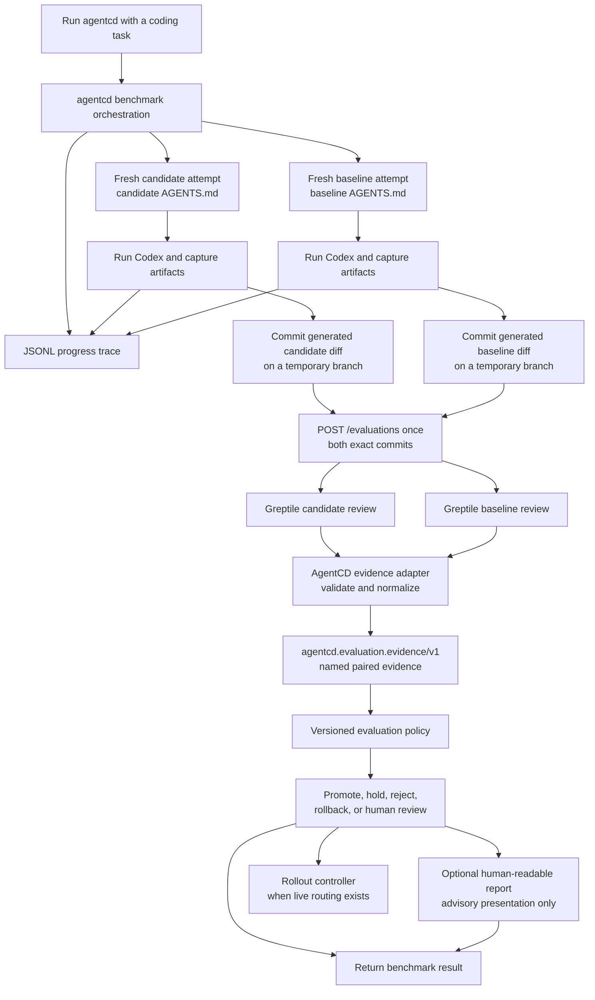

# Agent Evaluation And Progressive Rollout Plan

## Goal

Build a service that compares a baseline `AGENTS.md` configuration with a candidate configuration, evaluates the work produced by both agents, and makes an explainable rollout decision.

The first useful outcome is an offline decision about whether a candidate is eligible for shadow traffic. Later, the same policy consumes shadow and canary evidence to decide whether to hold, promote, reject, require human review, or roll back the candidate.

The existing implementation lives under `agentcd`. The synthetic prompt assets currently live at the repository root.

## Repository Baseline

This plan distinguishes what is implemented in this repository from integration work that is still being developed in parallel.

| Capability | Current repository state | Required next step |
| --- | --- | --- |
| CLI | `agentcd_bench.cli` accepts a repository, two commits, one prompt, a run count, a runner, optional trace-log path, optional evaluator URL, and compact or verbose JSON output | Keep it as the local entrypoint and add a stable machine-readable evidence and decision contract |
| Benchmark service | `run_benchmark` launches A and B concurrently, keeps attempts within each version sequential, and pairs attempts by run index for evaluation | Add explicit named roles and task metadata, cancellation, normalization, and policy invocation |
| Worktrees and artifacts | `WorktreeManager` creates two detached worktrees; evaluator-enabled runs reset each side before every attempt, capture patches and changed files, create unpushed temporary commits and branches, and clean up after evaluation | Version the artifact contract and verify repeated-run isolation and cleanup across failure paths |
| Codex execution | `CodexExecRunner` invokes `codex exec --json --ephemeral --sandbox workspace-write` with closed stdin; `MockCodexRunner` supports credential-free tests | Preserve fresh sessions while also capturing the final response, generated diff, failures, and bounded raw events |
| Metrics | Token, duration, and tool counts are summarized with average, p50, and p90 | Add paired quality, reliability, evaluator, and policy evidence |
| Tracing | A thread-safe JSONL logger records benchmark, worktree, version, and attempt progress | Attach trace artifacts to benchmark results and keep them distinct from policy evidence |
| Output | JSON plus a Markdown comparison table, execution metadata, log path, attempt artifacts, and raw paired evaluation-service responses when configured | Add a schema version, named baseline/candidate evidence, and the structured policy decision |
| Human-readable report | `agentcd-report` accepts JSON, JSONL, or text benchmark data and asks an OpenAI model to produce a prose comparison and recommendation | Make it consume the policy decision and normalized evidence after evaluation; keep it advisory and package its prompt asset reliably |
| Tests | Thirty AgentCD `unittest` tests pass: seven CLI/orchestration tests and twenty-three offline-policy tests; the FastAPI service also has four focused `pytest` tests | Add repeated-attempt isolation, Greptile-normalizer, and end-to-end policy-integration tests |
| Prompt data | Seed instructions and 1,000 synthetic prompt records exist | Curate runnable tasks and bind them to repositories, setup, and expected checks |
| Demo repository | `hugoDocs` points at the fork intended for the product demo, but the repository has no `.gitmodules` mapping | Make the demo checkout reproducible and curate its first runnable tasks and deterministic checks |
| FastAPI Greptile service | `service/` implements synchronous `POST /evaluations`, concurrently reviews both exact commits, and preserves independent success/failure results | Stabilize the raw response contract and publish captured Greptile response fixtures |
| AgentCD-to-FastAPI integration | With an explicit policy snapshot, evaluator-enabled benchmark runs normalize each raw paired response with attempt metrics, invoke the policy, return evidence and decision, and write deterministic Markdown | Add deterministic task-check execution, captured Greptile fixtures, and a versioned benchmark artifact contract |
| Offline evaluation policy | `agentcd_bench.evaluation` implements versioned contracts, configurable gates, deterministic decisions, and replayable fixtures | Add the adapter from benchmark and FastAPI outputs, then calibrate non-demo thresholds |
| Routing | Not present; neither the policy nor prose report changes traffic | Add only after trustworthy offline and shadow evidence exists |

The current AgentCD tests pass with `python3 -m unittest discover -s tests`; the FastAPI tests run separately from `service/` with `pytest`.

## Existing Evaluation Assets

The repository contains:

- `seed_prompts.md`: instructions and seed ideas for generating repository-dependent coding tasks.
- `greptile_synthetic_prompts.jsonl`: 1,000 records with `prompt`, `category`, `difficulty`, `language`, `framework`, and `multi_file` fields.
- `hugoDocs`: the forked Hugo documentation repository selected as the end-to-end product demo target.
- `agentcd/examples/grafana-like-codebase/AGENTS.md`: an example instruction file for a large Grafana-like repository.
- `agentcd/examples/grafana-like-codebase/prompt.txt`: one code-changing example task.

The JSONL catalog is balanced across ten categories and four difficulty levels. It contains 825 unique prompt texts; repeated text appears under different metadata in 131 duplicate groups. The language and framework values are synthetic labels and are not always a realistic pairing.

These records are a source pool, not yet a runnable evaluation suite. They do not identify a fixture repository, starting commit, setup procedure, deterministic success condition, or expected output. The Grafana-like example also contains instructions and a prompt but no matching codebase fixture, so it cannot independently support a meaningful code-quality evaluation. `hugoDocs` supplies the chosen demo codebase, but its task suite and deterministic assertions still need curation, and its gitlink is not reproducible until repository mapping or checkout setup is added. The current automated CLI test creates its own minimal temporary repository and uses the mock runner.

Before using synthetic prompts for promotion decisions, curate a small versioned suite. Each runnable task needs:

- a stable task identifier and suite version
- a repository or fixture and clean starting commit
- prompt, category, difficulty, and expected output type
- setup requirements and allowed tool/side-effect policy
- deterministic validation commands or task assertions when possible
- whether Greptile applies
- timeout and retry classification

Do not send all 1,000 prompts into a rollout decision. Start with a representative, manually checked subset and expand it as fixtures and expected checks become trustworthy.

## Responsibility Boundaries

The target system has six separate responsibilities:

- **FastAPI Greptile service:** exposes one synchronous `POST /evaluations` endpoint, validates an exact pair of branches and commits, runs both Greptile reviews concurrently, and returns both complete outputs.
- **Benchmark CLI/service:** creates isolated worktrees, runs the baseline and candidate agents on the same tasks, captures artifacts, and keeps worktrees alive until worktree-dependent evaluation is complete.
- **Evaluation pipeline:** receives the two Greptile outputs from the FastAPI service, combines them with deterministic checks, and normalizes them into paired evidence.
- **Evaluation policy:** consumes completed evidence and the current rollout stage, then returns a decision. It does not invoke agents, call Greptile, or mutate traffic.
- **Human-readable report renderer:** optionally turns the policy decision and its supporting evidence into prose for a PR or operator. It may explain the decision but cannot replace, override, or authorize it.
- **Rollout controller:** applies an approved decision to a router or feature-flag system. This remains separate from the policy.

The current CLI treats versions A and B as neutral labels. The landed integration sends A and B with explicit generated commits and temporary refs to `POST /evaluations`, then records the raw response. The next adapter must map candidate to A and baseline to B explicitly, convert the response into named candidate/baseline evidence, and call the evaluation function. It must not infer roles from list order or rely on the CLI's fallback commits.

## `hashim-eval` Branch Scope

This branch owns the first mergeable evaluation-policy vertical slice. Its job is to turn already-normalized benchmark evidence into an explainable offline rollout decision.

### Deliverables

1. **Evidence contract:** define the versioned input the policy accepts. It uses named baseline/candidate roles and never relies on raw A/B ordering.
2. **Policy configuration:** define versioned thresholds, required evaluators, required task segments, and non-inferiority margins outside the decision logic.
3. **Pure policy evaluation:** apply ordered gates with no network, filesystem, database, clock, or routing side effects.
4. **Decision report:** return a stable action, next stage, reason codes, gate results, observed values, thresholds, and missing evidence.
5. **Fixtures and tests:** cover every decision path and prove the same evidence plus complete policy snapshot always produces the same result.
6. **Integration boundary:** expose one service-level policy entrypoint that AgentCD can call after the benchmark and Greptile pipeline finishes.

### Implemented On This Branch

- `agentcd_bench.evaluation.models` defines immutable evidence, configuration, gate-result, and decision-report models with explicit enums and schema versions.
- `agentcd_bench.evaluation.parsing` validates external JSON-shaped payloads without adding a runtime dependency.
- `agentcd_bench.evaluation.validation` rejects unsupported schema or policy versions and inconsistent configuration before any decision is made.
- `agentcd_bench.evaluation.calculations` centralizes paired, segment, and aggregate calculations so gates use one comparison definition.
- `agentcd_bench.evaluation.completeness` isolates evidence and sample sufficiency from outcome scoring.
- `agentcd_bench.evaluation.gates` implements independent validity, safety, reliability, quality, and efficiency/objective gates.
- `agentcd_bench.evaluation.policy` applies the documented precedence and always returns all six gate statuses, marking gates skipped after an early decision as `not_evaluated`.
- `evaluate_policy_payload(evidence_payload, policy_config_payload)` is the synchronous AgentCD integration entrypoint; `evaluate_policy(...)` is the typed internal entrypoint.
- JSON fixtures under `tests/fixtures/evaluation` provide a canonical HugoDocs-shaped demo comparison, explicit demo-only thresholds, and replayable promote, hold, reject, and human-review cases.

This branch still expects an upstream adapter to translate benchmark artifacts and the FastAPI service's raw paired Greptile response into the normalized evidence schema. That adapter is intentionally not hidden inside the policy.

### Not Owned By This Branch

- the FastAPI Greptile endpoint or AgentCD orchestration
- Git worktree creation, cleanup, or attempt isolation
- invoking Codex or Greptile
- parsing live Greptile CLI output beyond agreeing on its normalized evidence shape
- changing feature flags or production traffic percentages

Those components supply evidence to or consume a decision from the policy. Keeping them outside the policy makes it possible to develop and fully test this branch with saved fixtures now.

### Required Inputs From Other Work

The policy contract needs these upstream guarantees:

- the benchmark adapter names baseline and candidate explicitly
- attempts have task, pair, version, and run identifiers
- both sides used comparable source, prompt, model, and tool configuration
- deterministic checks identify pass, fail, not applicable, or unavailable
- Greptile results are normalized into completion status and findings by severity/category
- operational metrics distinguish task failure from evaluator or runner infrastructure failure

Missing upstream fields do not block policy development. Represent them in fixtures as incomplete evidence and verify that policy v1 returns `hold` instead of guessing.

## End-To-End Flow



The exact call sequence is:

1. A user runs `agentcd` with a repository, explicit baseline and candidate refs, and a coding task.
2. In evaluator-enabled mode, benchmark orchestration resets each side to its starting commit, pairs attempts by run index, and runs Codex for candidate and baseline.
3. AgentCD captures each generated diff and creates an isolated temporary branch and commit for each result without pushing it.
4. While those refs still exist, AgentCD makes one synchronous `POST /evaluations` call containing the repository, base branch, both temporary branches, and both exact commit IDs.
5. FastAPI runs both Greptile CLI reviews concurrently and returns both complete outputs; one failure does not cancel the other.
6. An AgentCD adapter validates the returned Greptile outputs and combines them with deterministic checks and run artifacts to build `agentcd.evaluation.evidence/v1`.
7. AgentCD calls `evaluate_policy_payload(...)` with that evidence and a complete `agentcd.evaluation.policy-config/v1` snapshot.
8. AgentCD may invoke the advisory report renderer with that decision and its evidence. A report failure does not change the decision.
9. A rollout controller may apply the structured policy decision later when separately implemented and authorized. It never consumes prose as authorization.

Current `main` implements steps 1-8 for evaluator-enabled runs when an explicit policy configuration is supplied. The adapter maps A to candidate and B to baseline, verifies evaluator commit provenance, normalizes Greptile comments and attempt metrics, invokes the policy, and produces deterministic Markdown. Deterministic task checks are still upstream work; until an attempt supplies them, policies that require that evaluator correctly hold for missing evidence. Step 9 remains downstream work.

The HTTP call intentionally waits for both Greptile reviews. There is no queue, durable job API, webhook API, database, or background worker in this version. AgentCD must call the endpoint before its worktrees and temporary evaluation branches disappear.

## Benchmark Execution

The existing local interface remains valid:

```bash
python3 -m agentcd_bench \
  --project /path/to/repo \
  --commit-a candidate-sha \
  --commit-b baseline-sha \
  --prompt-file examples/grafana-like-codebase/prompt.txt \
  --runs 5
```

The first server integration may invoke this CLI with `--json-only --verbose` output so full per-attempt `git diff` patches are present in the JSON. Compact CLI output keeps diff metadata but omits the full patch. The preferred long-term integration is to call `agentcd_bench.service` directly so CLI parsing and terminal rendering stay outside the server workflow.

The service currently creates both worktrees and uses two worker threads to launch version A and version B concurrently. Repeated attempts inside each version remain sequential. Any future runner or evaluator shared across these two version threads must be concurrency-safe, or the orchestration must create one instance per version.

The Codex runner now uses an ephemeral session, explicitly requests `workspace-write`, and closes inherited stdin. This prevents session resume and unrelated interactive input while allowing edits inside the temporary worktree. It does not reset files changed by a prior attempt.

### Current Behavior That Must Change Before Evaluation

`run_benchmark` still reuses one A worktree and one B worktree for all repeated attempts. A real Codex attempt can modify files, so later attempts may inherit earlier work. The mock runner does not expose this problem because it only reads files.

Before results feed the policy:

- every attempt starts from a clean repository state
- each candidate attempt is paired with one baseline attempt for the same task
- paired attempts use the same source snapshot, prompt, model, runner settings, and tool policy
- pair and attempt identifiers are recorded explicitly
- concurrent or interleaved execution is protected against time-based drift
- infrastructure retries are distinguished from additional statistical samples
- timeouts and cancellation are supported

For a valid `AGENTS.md` experiment, unrelated source changes cannot differ between the baseline and candidate. Either the compared commits differ only in agent instructions, or the runner uses one fixed source snapshot and injects the two committed `AGENTS.md` versions. A PR with unrelated source changes is not automatically eligible for an `AGENTS.md` promotion decision.

## Benchmark Artifact Contract

The current runner returns status, usage metrics, tool metrics, and a return code. That is sufficient for an efficiency smoke test but not for quality evaluation.

Before a worktree is removed, each attempt must produce a durable, schema-versioned artifact containing:

- benchmark job, task, pair, version, and attempt identifiers
- named baseline or candidate role and resolved commit
- source snapshot and `AGENTS.md` version or content hash
- model, runner, and tool-policy configuration
- task identifier, suite version, and original prompt
- final agent response
- generated patch and changed-file list
- temporary evaluation commit identifier for code-changing tasks
- deterministic test, build, lint, or task-specific check results
- LLM token, latency, and cache metrics
- tool counts, durations, failures, and policy violations
- bounded execution logs with secrets removed

Tasks declare their expected output type. Greptile is required for code-changing tasks. Text-only or structured-output tasks use evaluators appropriate to those artifacts instead of failing because no code diff exists.

## Greptile Evaluation

Greptile is one evaluator in the evidence pipeline, not the policy itself and not the sole judge of quality.

For code-changing tasks, run Greptile against the work produced by both the baseline and candidate. Comparing both sides prevents the policy from treating every candidate finding as a regression when the baseline has the same or worse problem.

The Greptile CLI can review a local branch and emit machine-readable JSON. It reviews committed changes and ignores uncommitted changes. For evaluator-enabled runs, AgentCD now resets each detached benchmark worktree to its starting commit before the attempt, captures the generated changes, and creates an isolated temporary branch and commit before cleanup. These commits are evaluation artifacts only; they are not pushed to the user's repository.

AgentCD does not invoke Greptile directly. Once both paired attempt commits exist, it calls the FastAPI service exactly once:

```json
POST /evaluations

{
  "repo": "/path/to/repo",
  "base_branch": "main",
  "branch_a": "agentcd-eval/job-123/candidate",
  "commit_a": "candidate-result-sha",
  "branch_b": "agentcd-eval/job-123/baseline",
  "commit_b": "baseline-result-sha"
}
```

The service checks out each exact commit in its own temporary worktree and runs `greptile review --branch <base> --json` for both sides with Python async concurrency. It returns both complete Greptile outputs in the same response. A failed review includes its error, stderr or API response, exit code when available, duration, branch, and commit ID, while the other review is allowed to finish normally.

The current caller retains this raw response in benchmark output. The planned adapter will pass its normalized form, together with deterministic results and run metrics, to the evaluation function. The HTTP service does not compare the two results, select a winner, score the agents, or make a rollout decision.

Normalize Greptile output into evidence such as:

- review completion status
- confidence or review score when available
- finding count by severity and category
- critical security or correctness findings
- affected files and stable finding identifiers
- raw review artifact for debugging and audit

A Greptile timeout, authentication failure, or unavailable result is an evaluator infrastructure error. AgentCD may retry the endpoint or the failed side according to bounded retry rules added later. If the evidence remains unavailable, the evaluation function holds or requests human review; it never silently passes the candidate or counts the outage as a candidate-quality failure.

Greptile credentials are supplied to the FastAPI service through its environment and are never stored in artifacts or repository files.

Reference: [Greptile CLI documentation](https://www.greptile.com/docs/code-review/greptile-cli).

## Evaluation Policy

The evaluation policy is deterministic, versioned, replayable, and side-effect free. Given the same evidence and complete policy-configuration snapshot, it produces the same decision. This allows policy development and testing to proceed against saved fixtures while the CLI artifact contract is being completed.

### Contract Boundary

The policy accepts normalized evidence, not raw CLI JSON, JSONL traces, Greptile output, worktree paths, database records, or prose from `agentcd-report`. Adapters validate and normalize external evaluator formats before invoking the policy. A generated report is downstream presentation and can never authorize promotion or rollback.

Structurally invalid or unsupported input is a contract error and produces no rollout decision. Valid evidence that is incomplete or unavailable produces a `hold` decision with explicit missing-evidence reason codes unless the available evidence already contains a confirmed critical safety failure.

The implemented v1 identifiers are:

- evidence schema: `agentcd.evaluation.evidence/v1`
- policy configuration schema: `agentcd.evaluation.policy-config/v1`
- policy version: `offline-v1`
- decision schema: `agentcd.evaluation.decision/v1`

Unknown identifiers fail closed with `ContractError`. There are no fallback policy versions and no implicit production thresholds.

### Inputs

- evidence schema version
- baseline and candidate version identifiers
- current rollout stage, which must be `offline` in v1
- task-suite version, required segments, and paired observations
- per-task deterministic results for both sides
- normalized Greptile status and findings for both sides when applicable
- execution status, latency, token, cost, and tool-use metrics
- sample count, observation duration, and segment coverage
- the candidate's declared objective, such as quality, cost, or latency

Live rollout windows and prior decisions belong to a future evidence schema. They are not silently accepted by the offline-v1 policy.

### Policy Configuration

Policy behavior is data-driven and versioned. Configuration includes:

- policy identifier, version, and supported stage
- required evidence schema version
- required evaluators by task output type
- required task categories or traffic segments
- minimum paired samples and observation duration
- critical Greptile severities and forbidden policy violations
- reliability limits and baseline-relative regression margins
- quality non-inferiority margins
- token, duration, cost, and tool-use guardrails
- whether the candidate must declare an objective and its minimum improvement
- rules for when an otherwise valid result needs human review

Development fixtures may provide explicit temporary thresholds. Automatic promotion cannot use guessed production defaults; those thresholds must be calibrated from repeated baseline data and reviewed.

### Decisions

- **Promote:** the candidate may enter the next stage.
- **Hold:** evidence is incomplete, insufficient, or temporarily inconclusive.
- **Reject:** the offline or shadow candidate failed a required gate.
- **Rollback:** a candidate already serving traffic crossed a rollback boundary.
- **Human review:** evidence is valid but the configured policy cannot safely decide automatically.

Every result includes the current stage, proposed next stage, machine-readable reason codes, a human-readable explanation, every gate result, observed values, thresholds, sample and segment coverage, missing evidence, and policy version.

Stable reason-code families include:

- `EVIDENCE_INCOMPLETE` and `EVIDENCE_INCOMPARABLE`
- `SAMPLE_TOO_SMALL`, `SEGMENT_COVERAGE_MISSING`, and `OBSERVATION_WINDOW_TOO_SHORT`
- `CRITICAL_FINDING` and `FORBIDDEN_SIDE_EFFECT`
- `RELIABILITY_REGRESSION` and `QUALITY_REGRESSION`
- `EFFICIENCY_GUARDRAIL_FAILED` and `OBJECTIVE_NOT_MET`
- `EVALUATOR_CONFLICT` and `MANUAL_REVIEW_REQUIRED`
- `ALL_GATES_PASSED`

### Ordered Gates

Do not collapse all signals into one weighted score. Apply gates in order so low cost or latency cannot compensate for unsafe or incorrect work.

1. **Evidence validity:** schemas and policy versions are supported, configuration is internally consistent, identifiers are unique, values are well-formed, and paired source, prompt, model, runner, and tool settings are comparable.
2. **Safety:** no critical security issue, forbidden side effect, secret leak, or prohibited tool behavior. A confirmed critical failure can reject immediately even before the normal sample minimum is reached.
3. **Evidence completeness and sufficiency:** required evaluators completed and minimum paired samples, required segments, and observation duration are present. Otherwise the decision is hold.
4. **Reliability:** task failures and timeouts remain within absolute and baseline-relative limits. Infrastructure failures and missing evaluator output hold at completeness instead of being misclassified as candidate failure.
5. **Quality non-inferiority:** the candidate is not worse than the baseline beyond a configured margin. Deterministic task outcomes take priority over Greptile or other model-based signals.
6. **Declared objective and efficiency:** after all guardrails pass, the candidate demonstrates the quality, cost, latency, or tool-use improvement it was intended to make.

Critical safety failures cause immediate rejection or rollback. Valid, sufficient evidence that crosses a configured reliability, quality, efficiency, or objective threshold rejects; incomplete or insufficient evidence holds. Offline v1 does not infer statistical confidence beyond its explicit sample and observation-window requirements.

Decision precedence for policy v1 is:

1. reject malformed input at the contract boundary
2. reject a confirmed critical safety failure visible in otherwise valid evidence
3. hold valid but incomplete evidence
4. hold insufficient samples or segment coverage
5. reject a required reliability or quality guardrail failure
6. request human review for valid but conflicting or unsupported evidence
7. promote only when every required gate passes

### Comparison Rules

- Compare baseline and candidate within the same task pair before aggregating across tasks.
- Treat missing metrics as missing evidence, never as zero.
- Keep runner, evaluator, and task failures distinct; they have different policy meaning.
- Evaluate both overall results and every required category or segment so a large easy segment cannot hide a critical regression elsewhere.
- Use both absolute limits and baseline-relative margins where configured.
- Keep Greptile severity counts visible instead of converting all findings into one opaque score.
- Reliability and quality limits apply both overall and within every required segment.
- Efficiency guardrails apply overall, within every required segment, and to individual pairs when a segment contains multiple pairs, so an aggregate cannot hide a tail regression.
- Hold when sample size is too small to support the configured comparison; do not manufacture statistical confidence.

### Initial Offline Policy Scope

Policy v1 only decides whether an offline candidate is eligible for shadowing. It should not claim that a small synthetic benchmark is sufficient for canary or full production rollout.

The first policy uses:

- required normalized evaluator completion and traceable pair and attempt identifiers; artifact creation remains an upstream guarantee
- deterministic task pass/fail signals where fixtures provide them
- candidate-versus-baseline Greptile severity deltas for code-changing tasks
- execution success and timeout rates
- token, duration, estimated-cost, and tool-use guardrails
- minimum paired sample counts across required task categories

Exact thresholds remain configuration and must be calibrated using repeated baseline runs before automatic promotion is enabled.

`rollback` remains part of the long-term decision vocabulary but is not emitted by the offline-only v1 policy.

### `hashim-eval` Implementation Order

1. Define the versioned normalized-evidence, policy-configuration, gate-result, and decision-report contracts.
2. Create small saved fixtures for a healthy baseline/candidate pair, incomplete evidence, a critical Greptile finding, a quality regression, and an efficiency regression.
3. Implement each gate independently with explicit observed values and thresholds.
4. Implement the policy coordinator that applies the documented precedence and collects all explainability data.
5. Add stable reason codes and a deterministic summary derived only from the decision data; this remains the canonical explanation even if an optional model-written report is unavailable.
6. Expose one synchronous policy entrypoint for AgentCD and document the contract.

All six policy steps are implemented on `hashim-eval`. Current `main` now lands the FastAPI Greptile service and the AgentCD client that records its raw paired response. The remaining Phase 2 seam is to normalize that response with benchmark artifacts, invoke the policy, and include both evidence and decision in AgentCD output. The policy itself does not need live Codex, Greptile, FastAPI, or database access.

### Required Policy Test Matrix

- identical valid evidence produces identical serialized decisions
- complete non-inferior candidate evidence promotes to shadow
- missing required Greptile evidence holds
- insufficient paired samples or category coverage holds
- incomparable task, model, source, or tool configuration holds
- any configured critical Greptile finding rejects
- forbidden side effects reject regardless of speed or token savings
- reliability regression rejects
- deterministic quality regression rejects even if Greptile is clean
- efficiency regression rejects only after safety, reliability, and quality gates are valid
- conflicting but valid evaluator signals request human review when configured
- exact threshold-boundary behavior is tested explicitly
- unknown evidence or policy versions fail contract validation rather than silently falling back

### Branch Definition Of Done

- Saved fixtures can exercise every policy action supported by offline v1.
- Every decision is schema-versioned, serializable, explainable, and deterministic.
- Every gate exposes its status, deterministic summary, and applicable observed values and thresholds; every non-passing gate exposes stable reason codes.
- The policy performs no external I/O and has no dependency on FastAPI, Git, Codex, Greptile, or a database client.
- Contract errors are distinguishable from valid `hold`, `reject`, and `human review` decisions.
- The integration contract explains exactly what the benchmark and Greptile pipelines must supply.
- All policy tests and the existing CLI test suite pass.

## Human-Readable Reports

The repository now includes `agentcd-report`, which accepts arbitrary JSON, JSONL, or text input, loads guidance from `.claude/skills/agent-report/SKILL.md`, calls an OpenAI model, and writes a prose comparison. This is useful for operators, but its model-generated recommendation is nondeterministic and is not the evaluation policy.

Before it is used by FastAPI or a PR check:

- run it after the deterministic policy, never before or instead of the policy
- give it the schema-versioned decision report and normalized supporting evidence rather than an untyped data dump
- require it to preserve the policy action, stage, reason codes, observed values, and thresholds without inventing missing evidence
- label its prose as explanatory and keep the deterministic decision visible beside it
- persist the report model, prompt version, generation status, and output for auditability
- publish the policy decision even when report generation times out or fails
- make the report prompt available reliably when the package is installed outside a source checkout

The rollout controller reads only the structured policy decision. Neither a report recommendation nor a report-generation failure can change traffic.

## FastAPI Evaluation Endpoint

The FastAPI service is tracked under `service/` on current `main`. Its narrow contract exposes one workflow endpoint:

- `POST /evaluations`: synchronously review two exact commits with Greptile and return both complete results.

`repo` is optional when the service has `EVAL_DEFAULT_REPO` configured. `base_branch` defaults to `main`. AgentCD normally supplies both explicitly, together with both temporary branch names and commit IDs.

The endpoint is a narrow Greptile execution boundary, not a benchmark control plane. It does not accept coding prompts, run Codex, persist jobs, enqueue work, expose polling endpoints, receive GitHub webhooks, normalize evidence, or call the rollout policy. Those capabilities are not part of the current API design.

Because a review can take minutes, AgentCD uses a suitably long HTTP timeout and keeps its temporary refs alive through the response. API and Greptile timeouts are reported as evaluator infrastructure failures. Authentication is supplied to the service process through `GREPTILE_API_KEY` or an authenticated Greptile CLI session.

## Rollout Stages

Rollout percentages and thresholds are configuration, not hard-coded policy logic.

1. **Offline:** run the curated task suite against baseline and candidate. Passing only makes the candidate eligible for shadowing.
2. **Shadow:** the baseline response is served while the candidate receives the same input. Candidate output is evaluated but never returned to the user.
3. **Canary:** serve the candidate to a small, stable cohort, then increase through configured traffic stages.
4. **Active:** the candidate serves all traffic but remains continuously monitored against rollback gates.

Shadow execution must prevent duplicate side effects. Candidate tools are read-only, mocked, replayed, or otherwise isolated when the baseline request can mutate external state.

Promotion is conservative and requires sufficient evidence over clean windows. Severe safety or reliability regressions roll back immediately. Softer regressions hold or require repeated confirmation to avoid rollout flapping.

The evaluation policy only recommends the next action. A separately authorized rollout controller changes traffic. No router or feature-flag integration exists in the repository yet.

## State

The current version has no server-side persistence or durable job state. AgentCD owns the invocation lifecycle and records benchmark artifacts, raw Greptile responses, normalized evidence, the policy decision, the deterministic Markdown report path, and trace logs before cleaning up temporary refs when policy evaluation is enabled.

Future rollout state remains separate from benchmark execution:

- offline
- shadow
- canary at a configured percentage
- active
- paused
- rejected
- rolled back

Persist benchmark specifications, attempts, artifacts, normalized evidence, policy decisions, rollout history, and failure details. This allows a decision to be audited or replayed with a newer policy without rerunning expensive agents and evaluators.

## Metrics

Metrics already emitted by the CLI:

- model when present in Codex events or supplied explicitly
- input, output, total, reasoning, and cached-input tokens
- wall-clock duration
- total and per-tool call counts
- command execution counts from Codex `item.started` and `item.completed` events
- per-tool completed and failed counts
- per-tool duration when present in Codex events
- command samples and aggregated output character totals
- runner status and return code
- average, p50, and p90 summaries

If the runner does not emit `total_tokens`, the parser now falls back to input plus output tokens.

Evidence to add:

- deterministic task pass rate
- Greptile completion and findings by severity and category
- critical finding count
- baseline-versus-candidate paired wins, losses, and ties
- execution failure and timeout rates
- policy violations and forbidden side effects
- estimated cost when a versioned pricing source is available

Promotion decisions use paired deltas and stage-specific sample requirements rather than averages alone.

## Trace Logs

Each CLI invocation writes a JSONL progress trace by default under `agentcd/logs/`, which is ignored by git.

Default path:

```text
logs/agents-bench-<timestamp>.jsonl
```

The path can be overridden with `--log-file`. Explicit log file paths also receive the invocation timestamp before the suffix, so `--log-file logs/run.jsonl` writes `logs/run-<timestamp>.jsonl`. If `--log-file` points to a directory, the CLI writes `agents-bench-<timestamp>.jsonl` inside it.

Current events include:

- CLI start/end
- sanitized argv
- invocation cwd
- runner choice
- prompt source
- prompt length
- prompt SHA-256
- benchmark start/end
- setup progress
- resolved commits
- created worktree paths
- version submission and result collection
- version start/end
- attempt start/end
- per-attempt raw Codex stdout/stderr log paths
- full `git diff`
- changed files, diff name-status, porcelain status, and diff stat
- parsed attempt metrics
- summary creation
- attempt status
- total tokens, duration, and tool-call count

Raw inline prompt text is redacted from logs.

The logger serializes concurrent writes from the A and B threads. These logs make long-running local benchmarks observable, but they are not the benchmark artifact or the policy evidence contract. AgentCD includes their path in the corresponding benchmark result.

Each Codex invocation also streams raw output to separate files beside the main trace log:

- `<main-log-stem>.codex-a-run-1.stdout.jsonl`
- `<main-log-stem>.codex-a-run-1.stderr.log`
- `<main-log-stem>.codex-b-run-1.stdout.jsonl`
- `<main-log-stem>.codex-b-run-1.stderr.log`

Diff capture includes untracked files by marking them intent-to-add in the temporary worktree before running `git diff`. This makes moved directories show both tracked deletions and untracked additions in the logged patch.

## Delivery Phases

### Phase 0: Existing CLI Baseline

- Two-version CLI with A and B launched concurrently.
- Sequential repeated attempts inside two shared detached worktrees.
- Ephemeral Codex sessions with closed stdin.
- Token, duration, and tool metrics with JSON and table output.
- Thread-safe JSONL progress tracing.
- Seven passing CLI/orchestration unit and integration-style tests.
- Synthetic prompt catalog and one prompt/instruction example.
- An optional OpenAI-backed `agentcd-report` command and report-writing skill; its current prose recommendation is advisory, not policy output.
- A `hugoDocs` gitlink for the product demo that still needs reproducible repository mapping or checkout setup.
- A safe-push helper for synchronizing and pushing a branch without rewriting remote history.

### Phase 1: Trustworthy Offline Evidence

- Define a schema-versioned task and benchmark artifact contract.
- Curate a small runnable task suite from the synthetic prompt catalog and bind every task to a fixture and deterministic checks.
- Evaluator-enabled runs now reset each shared worktree before every attempt and pair attempts by run index; fully independent worktrees and cancellation remain.
- Generated diffs, changed-file records, and temporary per-attempt branches and commits are now captured for evaluator-enabled runs; final agent responses and a versioned artifact schema remain.
- Preserve current A/B concurrency and the CLI as the human-facing wrapper.

### Phase 2: Greptile Evidence And Policy V1

- AgentCD now calls the single synchronous `POST /evaluations` endpoint before each paired attempt's worktrees and temporary refs are removed.
- It sends both exact generated commits in one request and retains the complete raw response.
- AgentCD now normalizes named baseline and candidate Greptile results with per-attempt metrics; deterministic task-check execution remains.
- The versioned offline evaluation policy, payload parser, six gates, decision coordinator, and replay fixtures are implemented on `hashim-eval`.
- Use the `hashim-eval` normalized evidence contract and saved policy fixtures as the integration boundary.
- AgentCD now returns an explainable offline decision and deterministic Markdown artifact when given a policy snapshot.
- Adapt `agentcd-report` to render that structured decision downstream without becoming a second decision engine.

### Phase 3: Evaluation Integration

- Stabilize the one-endpoint request and response contract.
- Keep the existing bounded HTTP timeout and decide whether narrowly scoped retries are safe for evaluator infrastructure failures.
- Pass the paired response into the evaluation function and include normalized evidence in AgentCD output.
- After the local end-to-end workflow is stable, add a PR-triggered orchestration entrypoint above AgentCD; keep the internal `POST /evaluations` endpoint focused on paired Greptile execution rather than turning it into the webhook control plane.
- Keep real Greptile smoke tests optional and use captured JSON fixtures in normal tests.
- Adapt `agentcd-report` to render the structured decision without becoming a second decision engine.

### Phase 4: Shadow And Progressive Routing

- Accept paired production observations without serving candidate output.
- Enforce side-effect isolation and stage-specific policy gates.
- Integrate a separately authorized rollout controller with the selected router.
- Move through configured canary percentages and support automatic rollback.

## Test And Validate

Current validation:

- From `agentcd/`, `python3 -m unittest discover -s tests` runs forty-five tests and passes, including policy, evidence-adapter, Markdown-renderer, and end-to-end CLI integration coverage.
- From `service/`, `pytest` runs four FastAPI tests covering concurrent evaluation, independent failures, and request validation.
- `ruff check agentcd_bench/evaluation tests/test_evaluation_policy.py` passes.
- Saved JSON scenarios replay every offline-v1 action: promote, hold, reject, and human review.

Required validation as the system grows:

- Add rollback tests only when a future live-traffic policy version can actually emit rollback; offline-v1 deliberately cannot.
- Test prompt-suite validation, deduplication, fixture binding, and category coverage.
- Test Greptile normalization with captured success, findings, timeout, authentication, and malformed-output fixtures.
- Integration-test the AgentCD-to-FastAPI flow with mock Codex and Greptile runners.
- Verify every repeated attempt starts clean and temporary worktrees and branches are removed.
- Verify AgentCD makes one evaluation request per paired attempt and keeps both exact refs alive until the response completes.
- Verify one Greptile failure does not cancel or hide the other result.
- Verify missing evaluator data cannot accidentally promote a candidate.
- Verify a critical finding overrides improvements in speed or cost.
- Verify report output cannot alter a policy decision or authorize a rollout.
- Verify the structured decision is still returned when report generation fails.
- Verify report input and output preserve policy reason codes, observed values, and thresholds.
- Keep real Codex and Greptile smoke tests optional so normal tests do not require credentials or external services.

## Open Decisions

- Which curated coding tasks from the synthetic prompt pool will form the first `hugoDocs` demo suite?
- What deterministic success checks exist for each selected task?
- Which Greptile JSON fields become the stable normalized evidence contract?
- Which authenticated GitHub webhook or check-run component invokes AgentCD, and how are duplicate deliveries made idempotent?
- What are the initial non-inferiority margins, minimum paired samples, and observation windows?
- Which router or feature-flag system will own live traffic percentages?
- Which rollout actions are automatic and which require human approval?
- Which model and prompt version will render operator reports, and what cost and latency budget applies?
- How should the `hugoDocs` demo fork be made reproducible here: a configured submodule, an explicit clone/setup script, or another pinned-repository mechanism?
